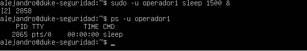
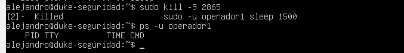

# 🛡️ Módulo 02: Auditoría de Logs y Gestión de Procesos

## Caso de Estudio: "Operación Rescate"

### 🚨 1. Descripción del Incidente
Durante la supervisión del servidor central, se detectaron anomalías críticas: intentos de acceso no autorizados seguidos por la ejecución de un proceso persistente en segundo plano bajo la identidad del usuario `operador1`. 

---

### 🔍 2. Fase de Auditoría (Detección y Análisis)
Se realizó una inspección forense sobre los registros de autenticación del sistema para rastrear el vector de entrada.

- **Comando utilizado:** `sudo grep "failure" /var/log/auth.log`
- **Hallazgo:** Se confirmaron tres (3) fallos consecutivos de autenticación (`authentication failure`) dirigidos a la cuenta `operador1`. Esto denota un patrón de ataque por fuerza bruta o adivinación de credenciales.

---

### ⚔️ 3. Fase de Contención (Identificación y Exterminio)
Con el acceso comprometido, se procedió a auditar la memoria RAM activa del servidor para verificar la persistencia del atacante.

#### A. Rastreo del Proceso Fantasma
- **Comando utilizado:** `ps -u operador1`
- **Resultado:** Se detectó un subproceso oculto ejecutando el comando `sleep 1500`.
- **Identificación del Objetivo:** El sistema operativo determinó que el **PID exacto** de la amenaza era el **2865**.
- 

#### B. Mitigación y Limpieza
Para evitar la persistencia del intruso, se aplicó una señal de terminación forzosa a nivel de kernel (`SIGKILL`).

- **Comando de remediación:** `sudo kill -9 2865`
- **Verificación:** Al re-ejecutar el escáner `ps -u operador1`, la consola confirmó el estado `Killed` y arrojó una lista limpia. La memoria RAM quedó descontaminada con éxito.
- 

---

### 📝 4. Conclusiones de Hardening
Para evitar futuros vectores de compromiso en esta cuenta, se recomienda:
1. Implementar políticas de contraseñas robustas (mínimo 14 caracteres con aleatoriedad).
2. Desplegar `Fail2Ban` para bloquear IPs tras 3 intentos fallidos automatizados.
